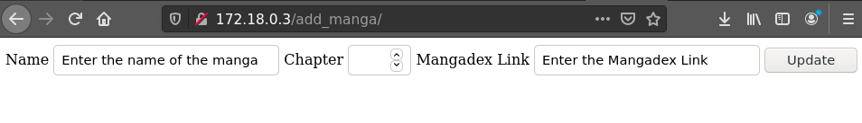
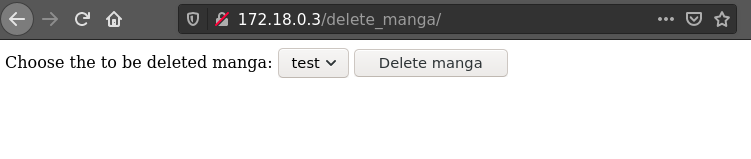

# mangalist

This is an example project where a Django web application gets build and automatically tested with a pipeline.

The Django project was written by myself to show some basic understanding and my usual style of Python. It can either be run by installing nginx and configuring the server locally or by running an included Docker image.

The website looks like this 

 and can execute the CRUD functions, e.g:
    1. Add an entry
    2. Read an entry
    3. Update an entry
    4. Delete an entry

The website uses a local MongoDB database which can be either started with Docker with a command such as :
    `docker run -d -p 27017:27017 -v ~/data:/data/db --name mongo --network mynet mongo
`
which runs the proecess in the background on port 27017 and a local volume called at `~/data` and the process is called `mongo`. A network has to created for the two Docker images, one for the application and one for the database, to communicate with each other.

Such a network can be created with the following command: 
`docker create network mynet`

The Django application is available under https://hub.docker.com/repository/docker/nullbubble/mangalist and can be started with the following Docker command:
`docker run -d --network mynet nullbubble/mangalist:latest` which should automatically download the image if it is not locally available.

In this project are several other files such as:

- An example Ansible playbook which would configure the Django application on the server without the use of a Docker image.

- The Dockerfile which was used to create the image containing the Django application. It is built on an Ubuntu base with a _very_ simple multi stage build to reduce the size by more than half. 

There are a few things that need to be done before the imagine can be created. First a Docker network has to be created with the command shown above. After that a MongoDB instance has to be started with the command shown above and then the image can be built with :
`docker build -t mangalist --network mynet .`

The Docker image can only be built if a working database is available at the building process because the database has to be initialized at the building process. The network is needed for the communication between the container.

- A couple of very basic Kubernetes deployment and service files which can be used to start both containers.

- A gitlab-ci.yml file which tests the Django application, uploads and deploys the image.
